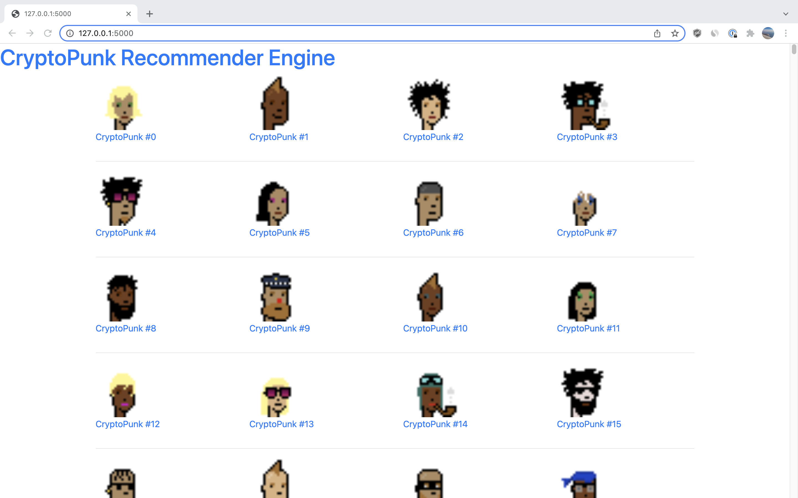
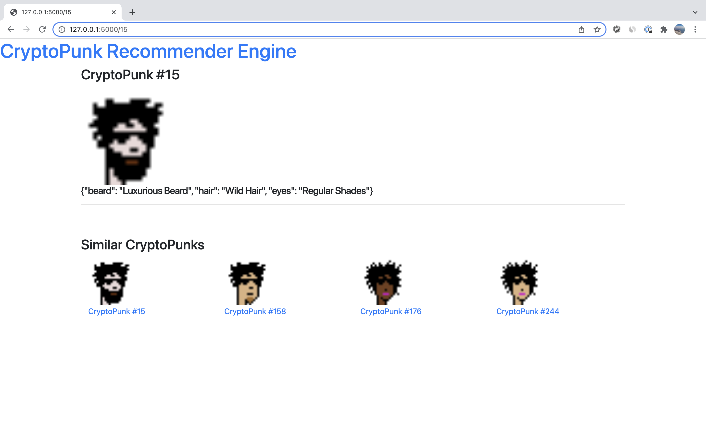

## CryptoPunk recommender engine
I want to build a recommendation engine for cryptopunks. 
Right now I'm simplity finding similar punks based on intersection of their attributes.
But ultimately we want to have a hybrid recommendation engine using years of bidding data, and the attributes combined. 


## Work to be done
- Use bidding data for cryptopunks to train a hybrid lightFM recommnedation model (works great with cold starts)
- Build a similarity matrix fast. Then use TF-IDF.
- Read HEX color codes from the image, and use KNN to find punks with similar color combinations.


## How to run
```
python3 populate.py
export FLASK_APP=app
flask run

```




